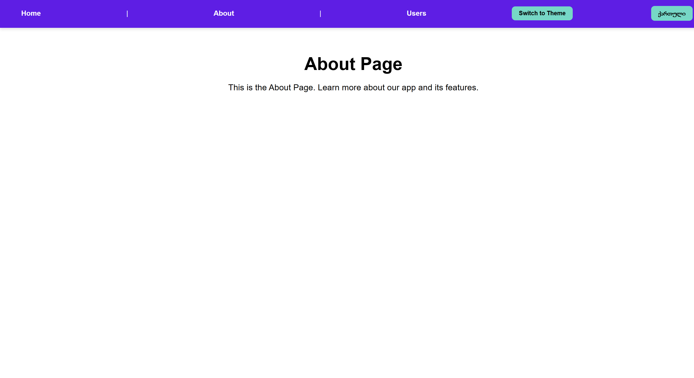
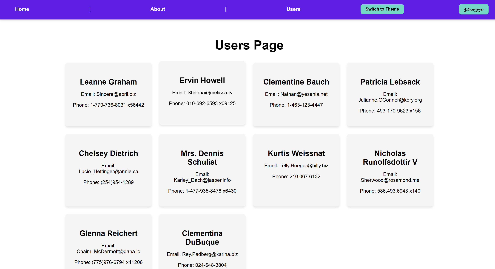
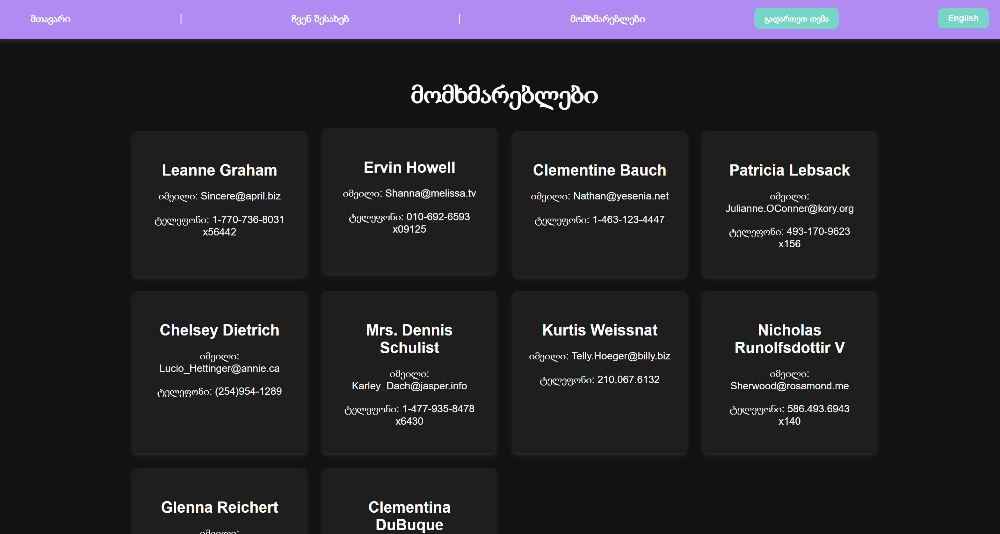

# Multi-Language React Users app
This is a multi-language React app built with **Vite**. It supports **English** and **Georgian** languages, includes a dark/light theme, and uses a free API to fetch user data. The app is fully responsive and uses modern React features like hooks, custom hooks, and React Router.

## Features

- **Multi-Language Support**: Switch between English and Georgian.
- **Dark/Light Theme**: Toggle between dark and light themes.
- **Responsive Design**: Works on mobile, tablet, and desktop.
- **3 Pages**:
  - **Home**: A welcoming page.
  - **About**: A page with information about the app.
  - **Users**: Fetches and displays user data from a free API.
- **React Router**: Navigation between pages.
- **Local Storage**: Persists theme preference.

## Tools and Technologies Used

- **Vite**: Fast build tool for modern web development.
- **React**: JavaScript library for building user interfaces.
- **React Router**: For client-side routing.
- **Axios**: For making HTTP requests to fetch user data.
- **CSS**: Custom styles for responsive design and themes.
- **React Context API**: For managing language and theme states.
- **Local Storage**: To persist the user's theme preference.

## Pages

### 1. Home Page
- Displays a welcoming message.
- Supports both English and Georgian languages.

### 2. About Page
- Provides information about the app.
- Supports both English and Georgian languages.

### 3. Users Page
- Fetches user data from [JSONPlaceholder](https://jsonplaceholder.typicode.com/users).
- Displays user names, emails, and phone numbers.
- Supports both English and Georgian languages.


### screenshots






## 🚀 How to Run Locally

1. Clone the repository:
  ```sh
  git clone https://github.com/mariambedo/users.git
  ```
2. Navigate to the project folder:
  ``` sh
  cd your-repo-name
  ```
3. Install dependencies:
  ```sh
  npm install
  ```
4. Start the development server:
  ``` sh
  npm run dev
  ```

## Live Demo

https://mariambedo.github.io/users